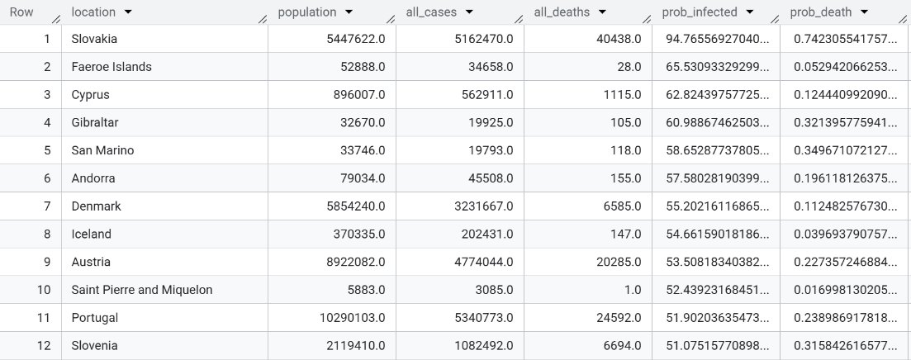

# 🦠 COVID-19 Global Data Analysis (SQL)
**Exploratory data analysis of the global COVID-19 pandemic using SQL (Google BigQuery), covering data cleaning, multi-table joins, window functions, and pandemic growth forecasting.**

## 📋 Table of Contents

- [Project Overview](#-project-overview)
- [Database Schema](#-database-schema)
- [Key Findings](#-key-findings)
- [Project Structure](#-project-structure)
- [Analysis Breakdown](#-analysis-breakdown)
 - [Data Cleaning](#-bronze--data-cleaning)
 - [Deep Dive Analysis](#-silver--deep-dive-analysis)
 - [Global Forecasting](#-gold--global-forecasting)
 - [Custom Research Questions](#-custom-research-questions)
- [SQL Techniques Used](#-sql-techniques-used)
- [How to Run](#-how-to-run)
- [Data Source](#-data-source)

---

## 🎯 Project Overview

This project analyzes real-world COVID-19 data provided by [Our World in Data](https://ourworldindata.org/coronavirus) to uncover patterns in infection rates, mortality, vaccination progress, and hospital capacity across countries and continents.

**The analysis is structured in three tiers of increasing complexity:**

| Focus | Key Skills |
|-------|------------|
| Data cleaning & validation | `IFNULL`, `REGEXP_REPLACE`, `GROUP BY`, `HAVING` |
| Country comparisons & trend analysis | `Window Functions`, `LAG`, `RANK`, `CTEs` |
| Pandemic growth forecasting | `POWER`, rolling averages, multi-CTE pipelines |

---

## 🗄 Database Schema


## 🔑 Key Findings

- **Case Fatality Rate:** Identified countries with the highest probability of death among confirmed cases, revealing stark differences in healthcare outcomes.
- **Global Infection/Death Rates:** Computed worldwide aggregates using subquery-based population deduplication to avoid double-counting.
- **Treatment Success:** Used `FIRST_VALUE` / `LAST_VALUE` window functions to compare ICU patient counts over time — identifying countries that successfully reduced critical care burden.
- **UK Deep Dive (2021):** Monthly breakdown of cases, deaths, tests, vaccinations, and hospital admissions showed the impact of the vaccination rollout.
- **Daily Trend Detection:** Built a trend classifier (`Increase` / `Decrease` / `No change`) using `LAG` and `CASE` to track day-over-day case changes per country.
- **Italy's Deadliest Months:** November and December 2020 recorded over 18,000 deaths each — the peak of Italy's COVID crisis.
- **Testing Gaps:** Brazil led with a ~78% positive test rate, suggesting massive under-testing and that tests were primarily given to symptomatic individuals.
- **Kazakhstan Forecast:** Built a 5-day case forecast using rolling 10-day growth factors with outlier filtering.

---

## 📸 Query Results

### Silver — Deep Analysis

<details>
<summary>Q1: Highest Case Fatality Rate</summary>

[](https://github.com/Amirski77/covid19-SQL-analysis/blob/main/q1_case_fatality.png.png)
)
</details>

<details>
<summary>Q2: Infection & Death Rate by Country</summary>


</details>

<details>
<summary>Q3: Global Infection & Death Rate</summary>

[
](https://github.com/Amirski77/covid19-SQL-analysis/blob/main/Global%20Rate.png?raw=true)
</details>

<details>
<summary>Q4: Countries That Reduced ICU Burden</summary>

[
])
</details>

<details>
<summary>Q5: UK Monthly Dashboard (2021)</summary>

[
</details>

<details>
<summary>Q6: Daily Trend Analysis</summary>


</details>

<details>
<summary>Q7: Top Country per Day — March 2020</summary>


</details>

<details>
<summary>Q8: Top 25 Mortality Rate</summary>


</details>

### Gold — Forecasting

<details>
<summary>Q9: Kazakhstan 5-Day Forecast</summary>


</details>

### Custom Research

<details>
<summary>Italy: Top 5 Deadliest Months</summary>


> November and December 2020 were the deadliest months for Italy, each exceeding 18,000 deaths.
</details>

<details>
<summary>Top 10 Countries by Infection Rate</summary>


</details>

<details>
<summary>Vaccination Rankings</summary>


</details>

<details>
<summary>Top 10 by Positive Test Rate</summary>


> Brazil ~78%, Iran ~39% — high positive rates indicate severe under-testing, with tests primarily given to symptomatic patients.
</details>

---

## 📁 Project Structure

```text
covid19-sql-analysis/
├── README.md                  # Project documentation
├── screenshots/               # Visualizations for the README
├── docs/
│   └── schema.md              # Database schema and details
└── sql/                       # Organized SQL queries
   ├── bronze/                # Data cleaning & validation
   │   ├── 01_check_duplicates.sql
   │   ├── 02_validate_iso_codes.sql
   │   ├── 03_find_islands.sql
   │   ├── 04_clean_country_names.sql
   │   ├── 05_data_types_review.sql
   │   └── 06_handle_nulls.sql
   ├── silver/                # Deep dive analysis
   │   ├── 01_case_fatality_rate.sql
   │   ├── 02_infection_death_rate_country.sql
   │   ├── 03_global_infection_death_rate.sql
   │   ├── 04_treatment_success.sql
   │   ├── 05_uk_monthly_overview.sql
   │   ├── 06_daily_trend_analysis.sql
   │   ├── 07_top_countries_march_2020.sql
   │   └── 08_top25_mortality.sql
   ├── gold/                  # Forecasting & Advanced Logic
   │   └── 09_kazakhstan_forecast.sql
   └── custom/                # Additional hypothesis testing
       ├── italy_deadliest_months.sql
       ├── top10_infection_rate.sql
       ├── vaccination_rankings.sql
       └── positive_test_rate.sql
```


## 🥇 Gold — Global Forecasting

**Question 9: 5-Day COVID Forecast for Kazakhstan**

Built a multi-stage forecasting pipeline using 4 chained CTEs:

```
Raw Data → Growth Factor Calculation → Outlier Filtering → Rolling Average → 5-Day Forecast
```

1. **Extract** daily new cases with `LAG` for previous-day comparison
2. **Calculate** daily growth factor (day N / day N-1)
3. **Filter outliers** (growth factors between 0.5x and 5x)
4. **Smooth** using 10-day rolling average window
5. **Project** forward: `current_cases × growth_factor ^ 5`

---

### 🔬 Custom Research Questions

Four additional self-designed analyses with visualizations:

| # | Question | Key Finding |
|---|----------|-------------|
| 1 | Top 5 deadliest months in Italy | Nov–Dec 2020 peaked at 18,000+ deaths/month |
| 2 | Top 10 countries by infection rate | Identified nations with highest population penetration |
| 3 | Vaccination rankings by country | Compared full-vaccination coverage globally |
| 4 | Top 10 by positive test rate | Brazil ~78%, Iran ~39% — indicating severe under-testing |

> Custom questions #1 and #4 use **analytic/window functions** (`DENSE_RANK`, aggregation with `NULLIF`).

---

## 🛠 SQL Techniques Used

| Category | Techniques |
|----------|-----------|
| **Joins** | `INNER JOIN`, `LEFT JOIN`, multi-table joins (up to 4 tables) |
| **Aggregation** | `SUM`, `MAX`, `COUNT`, `AVG`, `GROUP BY`, `HAVING` |
| **Window Functions** | `LAG`, `RANK`, `DENSE_RANK`, `FIRST_VALUE`, `LAST_VALUE`, rolling `AVG` |
| **CTEs** | Single and multi-CTE pipelines (up to 4 chained CTEs) |
| **Data Cleaning** | `IFNULL`, `NULLIF`, `REGEXP_REPLACE`, `LENGTH`, `LIKE` |
| **Date Functions** | `FORMAT_DATE`, `BETWEEN`, date filtering |
| **Math** | `POWER` for exponential forecasting, percentage calculations |
| **Conditional Logic** | `CASE WHEN` for trend classification |

---

## ▶️ How to Run

1. **Platform:** Google BigQuery (free tier available)
2. **Dataset:** Import the COVID-19 dataset from [Our World in Data](https://ourworldindata.org/coronavirus)
3. **Execute:** Run SQL files in order (Bronze → Silver → Gold → Custom)
4. **Note:** Table references use `da-nfactorial.covid19.*` — update the project/dataset prefix to match your BigQuery environment

```sql
-- Example: Update table references for your project
-- FROM `da-nfactorial.covid19.cases`
-- TO   `your-project.your-dataset.cases`
```

---

## 📖 Data Source

- **Provider:** [Our World in Data — COVID-19 Dataset](https://ourworldindata.org/coronavirus)
- **Tables:** Cases, Demography, Hospital, Regions, Tests, Vaccinations
- **Join Keys:** `iso_code` (country identifier) and `date`

---

## 📬 Contact

Feel free to reach out if you have questions about this analysis or want to discuss the methodology!

 LinkedIn: www.linkedin.com/in/amir-r-673789203
 Email: amirrashidov14@gmail.com
